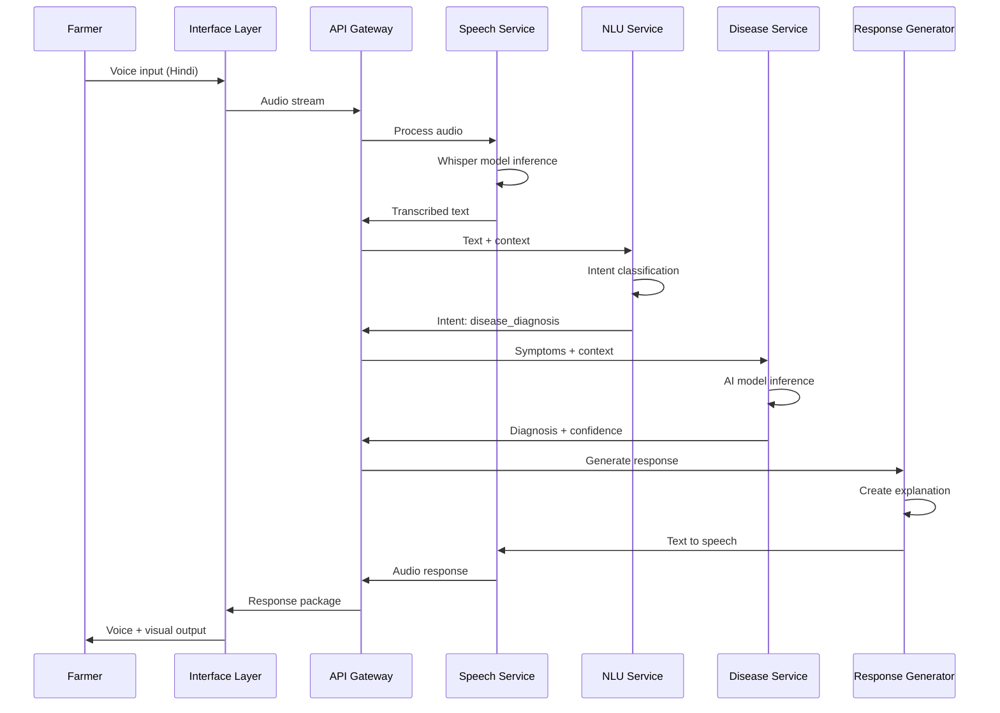

# Design Document: KrishiSarathi (Farmer's Guide)

## Overview

KrishiSarathi is a voice-first, AI-powered agricultural assistant designed to serve Indian farmers across language and digital divides. The system employs a three-layer microservices architecture with specialized AI models for speech recognition, natural language understanding, disease diagnosis, and personalized recommendations. The design prioritizes low-latency responses (<5s), multi-channel access (Web, WhatsApp, IVR), and responsible AI practices including explainability, bias mitigation, and human expert escalation.

The system integrates with government APIs (AgMarkNet for prices, IMD for weather, BHASHINI for translation) and maintains a knowledge base of agricultural information covering 50+ diseases, 20+ government schemes, and 30+ commodities across 8 Indian regional languages.

## Hackathon Scope Clarification

This submission focuses on **system design and AI architecture**
validated through mock data and prototype workflows.

Due to hackathon time constraints, the following are demonstrated
at prototype or simulated level:
- Disease diagnosis (limited crops)
- Weather integration (single API)
- Hindi-first voice interaction
- Explainability and confidence-based escalation

The architecture is intentionally designed to be **scalable post-hackathon**
but the MVP prioritizes correctness, usability, and social impact.

## TL;DR for Judges

KrishiSarathi is a voice-first AI assistant for Indian farmers that:
- Works on smartphones AND feature phones
- Supports regional languages
- Diagnoses crop diseases with explainable AI
- Escalates low-confidence cases to human experts
- Operates under ₹5/month per farmer

Built for Bharat. Designed for scale.


## Architecture

### High-Level Architecture

KrishiSarathi follows a three-layer architecture:

```
┌─────────────────────────────────────────────────────────────┐
│                    INTERFACE LAYER                          │
│  ┌──────────┐  ┌──────────┐  ┌──────────┐  ┌──────────┐   │
│  │   Web    │  │ WhatsApp │  │   IVR    │  │   SMS    │   │
│  │   PWA    │  │   Bot    │  │  (Voice) │  │ (Future) │   │
│  └──────────┘  └──────────┘  └──────────┘  └──────────┘   │
└─────────────────────────────────────────────────────────────┘
                            ↓
┌─────────────────────────────────────────────────────────────┐
│                   AI PROCESSING LAYER                       │
│  ┌──────────────┐  ┌──────────────┐  ┌──────────────┐     │
│  │   Speech     │  │     NLU      │  │   Disease    │     │
│  │ Recognition  │  │   Engine     │  │  Diagnoser   │     │
│  │  (Whisper)   │  │ (BharatGPT)  │  │ (CNN+BERT)   │     │
│  └──────────────┘  └──────────────┘  └──────────────┘     │
│  ┌──────────────┐  ┌──────────────┐  ┌──────────────┐     │
│  │    Text      │  │ Recommender  │  │   Response   │     │
│  │  Synthesis   │  │    Engine    │  │  Generator   │     │
│  │   (TTS)      │  │    (CF)      │  │   (LLM)      │     │
│  └──────────────┘  └──────────────┘  └──────────────┘     │
└─────────────────────────────────────────────────────────────┘
                            ↓
┌─────────────────────────────────────────────────────────────┐
│                      DATA LAYER                             │
│  ┌──────────────┐  ┌──────────────┐  ┌──────────────┐     │
│  │  PostgreSQL  │  │   Vector DB  │  │  Redis Cache │     │
│  │  (Metadata)  │  │  (Semantic)  │  │  (Sessions)  │     │
│  └──────────────┘  └──────────────┘  └──────────────┘     │
│  ┌──────────────┐  ┌──────────────┐  ┌──────────────┐     │
│  │  AgMarkNet   │  │     IMD      │  │   BHASHINI   │     │
│  │    (API)     │  │    (API)     │  │    (API)     │     │
│  └──────────────┘  └──────────────┘  └──────────────┘     │
└─────────────────────────────────────────────────────────────┘
```

## AI Stack Flexibility

The system is model-agnostic by design.

During the hackathon:
- AWS-native services (Transcribe, Polly, SageMaker) are preferred
  due to credits and deployment ease.

Post-hackathon:
- Open-source or BharatGPT-based models may replace components
  for cost and sovereignty reasons.

All AI services are abstracted behind microservice interfaces.


### Microservices Architecture

The system is decomposed into independent microservices:

1. **API Gateway Service**: Routes requests, handles authentication, rate limiting
2. **Speech Service**: Converts speech to text and text to speech
3. **NLU Service**: Understands user intent and extracts entities
4. **Disease Service**: Diagnoses crop diseases from symptoms
5. **Scheme Service**: Determines government scheme eligibility
6. **Market Service**: Fetches and caches market prices
7. **Weather Service**: Provides location-based weather forecasts
8. **Recommendation Service**: Personalizes advice based on user history
9. **Expert Service**: Manages human expert escalation
10. **Analytics Service**: Tracks usage, bias metrics, and performance

### Data Flow


MVP demonstrates Hindi language support;
architecture supports scaling to 8 Indian languages.


## Components and Interfaces

### 1. API Gateway Service

**Responsibilities:**
- Request routing to appropriate microservices
- Authentication and session management
- Rate limiting and DDoS protection
- Request/response logging for analytics

**Interface:**
```python
class APIGateway:
    def route_request(request: Request) -> Response:
        """Routes incoming request to appropriate service"""
        
    def authenticate_user(session_id: str) -> User:
        """Validates user session and returns user context"""
        
    def apply_rate_limit(user_id: str) -> bool:
        """Checks if user has exceeded rate limits"""
        
    def log_request(request: Request, response: Response) -> None:
        """Logs request/response for analytics"""
```

### 2. Speech Service

**Responsibilities:**
- Speech-to-text conversion using fine-tuned Whisper model
- Text-to-speech synthesis in 8 regional languages
- Audio quality enhancement and noise reduction
- Accent and dialect handling

**AI Model:** Fine-tuned OpenAI Whisper (medium) on Indian language agricultural corpus

**Interface:**
```python
class SpeechService:
    def speech_to_text(
        audio: bytes,
        language: Language,
        context: Optional[str]
    ) -> SpeechResult:
        """
        Converts audio to text
        Returns: transcribed text, confidence score, detected language
        """
        
    def text_to_speech(
        text: str,
        language: Language,
        voice_profile: VoiceProfile
    ) -> bytes:
        """
        Converts text to natural-sounding speech
        Returns: audio bytes in MP3 format
        """
        
    def enhance_audio(audio: bytes) -> bytes:
        """Removes background noise and enhances clarity"""
```

**Data Structures:**
```python
@dataclass
class SpeechResult:
    text: str
    confidence: float  # 0.0 to 1.0
    language: Language
    duration_ms: int
    
@dataclass
class Language:
    code: str  # 'hi', 'ta', 'te', etc.
    name: str  # 'Hindi', 'Tamil', etc.
```

### 3. NLU Service

**Responsibilities:**
- Intent classification (disease_diagnosis, scheme_query, market_price, weather, general_query)
- Entity extraction (crop type, location, symptoms, date)
- Context management for multi-turn conversations
- Handling colloquial and agricultural terminology

**AI Model:** Fine-tuned BharatGPT (or mT5) on agricultural conversation dataset

**Interface:**
```python
class NLUService:
    def classify_intent(
        text: str,
        language: Language,
        conversation_history: List[Turn]
    ) -> Intent:
        """
        Classifies user intent from text
        Returns: intent type, confidence, extracted entities
        """
        
    def extract_entities(
        text: str,
        intent: Intent
    ) -> Dict[str, Entity]:
        """
        Extracts relevant entities based on intent
        Returns: dictionary of entity types to values
        """
        
    def manage_context(
        session_id: str,
        new_turn: Turn
    ) -> ConversationContext:
        """Updates and returns conversation context"""
```

**Data Structures:**
```python
@dataclass
class Intent:
    type: IntentType  # Enum: DISEASE, SCHEME, MARKET, WEATHER, GENERAL
    confidence: float
    entities: Dict[str, Entity]
    
@dataclass
class Entity:
    type: str  # 'crop', 'symptom', 'location', etc.
    value: str
    confidence: float
    
@dataclass
class ConversationContext:
    session_id: str
    user_profile: UserProfile
    conversation_history: List[Turn]
    extracted_context: Dict[str, Any]  # crop, location, etc.
```

### 4. Disease Service

**Responsibilities:**
- Diagnose crop diseases from symptom descriptions
- Consider contextual factors (location, season, crop variety)
- Provide confidence scores and multiple hypotheses
- Generate treatment recommendations
- Escalate low-confidence cases to experts

**AI Models:**
- **Text-based:** Fine-tuned BERT for symptom-to-disease classification
- **Image-based:** ResNet50 CNN for leaf/crop image analysis
- **Hybrid:** Ensemble model combining text and image inputs

**Interface:**
```python
class DiseaseService:
    def diagnose_from_text(
        symptoms: List[str],
        crop: str,
        context: DiagnosisContext
    ) -> DiagnosisResult:
        """
        Diagnoses disease from text symptoms
        Returns: ranked list of diseases with confidence scores
        """
        
    def diagnose_from_image(
        image: bytes,
        crop: str,
        context: DiagnosisContext
    ) -> DiagnosisResult:
        """
        Diagnoses disease from crop/leaf image
        Returns: ranked list of diseases with confidence scores
        """
        
    def get_treatment(disease: Disease) -> Treatment:
        """Returns treatment recommendations for disease"""
        
    def should_escalate(diagnosis: DiagnosisResult) -> bool:
        """Determines if case should be escalated to expert"""
        
    def explain_diagnosis(
        diagnosis: DiagnosisResult,
        language: Language
    ) -> str:
        """Generates human-readable explanation of diagnosis"""
```

**Data Structures:**
```python
@dataclass
class DiagnosisContext:
    location: Location
    season: Season
    soil_type: Optional[str]
    crop_variety: Optional[str]
    weather_recent: Optional[WeatherData]
    
@dataclass
class DiagnosisResult:
    diseases: List[DiseaseHypothesis]  # Ranked by confidence
    confidence_threshold_met: bool  # True if top result > 60%
    explanation: str
    should_escalate: bool
    
@dataclass
class DiseaseHypothesis:
    disease: Disease
    confidence: float
    matching_symptoms: List[str]
    treatment: Treatment
    
@dataclass
class Disease:
    id: str
    name: Dict[Language, str]  # Multilingual names
    symptoms: List[str]
    affected_crops: List[str]
    
@dataclass
class Treatment:
    chemical_control: List[str]
    organic_control: List[str]
    preventive_measures: List[str]
    estimated_cost: Optional[float]
```

### 5. Scheme Service

**Responsibilities:**
- Determine government scheme eligibility
- Ask qualifying questions in conversational manner
- Provide scheme details and application procedures
- Track scheme updates and new launches

**Interface:**
```python
class SchemeService:
    def get_qualifying_questions(
        user_profile: UserProfile
    ) -> List[Question]:
        """Returns questions needed to determine eligibility"""
        
    def check_eligibility(
        user_profile: UserProfile,
        answers: Dict[str, Any]
    ) -> List[EligibleScheme]:
        """
        Determines which schemes user is eligible for
        Returns: list of schemes with eligibility details
        """
        
    def get_scheme_details(
        scheme_id: str,
        language: Language
    ) -> SchemeDetails:
        """Returns detailed information about a scheme"""
```

**Data Structures:**
```python
@dataclass
class EligibleScheme:
    scheme: Scheme
    eligibility_score: float  # How well user matches criteria
    missing_requirements: List[str]
    application_url: str
    
@dataclass
class Scheme:
    id: str
    name: Dict[Language, str]
    description: Dict[Language, str]
    benefits: List[str]
    eligibility_criteria: List[Criterion]
    required_documents: List[str]
    application_process: List[str]
    
@dataclass
class Criterion:
    field: str  # 'land_size', 'income', 'crop_type', etc.
    operator: str  # '<', '>', '==', 'in', etc.
    value: Any
```

### 6. Market Service

**Responsibilities:**
- Fetch real-time market prices from AgMarkNet API
- Cache prices to reduce API calls and improve response time
- Calculate nearest mandis based on user location
- Track price trends and alert on significant changes

**Interface:**
```python
class MarketService:
    def get_prices(
        crop: str,
        location: Location,
        max_distance_km: int = 50
    ) -> List[MarketPrice]:
        """
        Returns prices from nearby mandis
        Uses cache if data is fresh (<4 hours)
        """
        
    def get_price_trend(
        crop: str,
        mandi: str,
        days: int = 30
    ) -> PriceTrend:
        """Returns historical price trend"""
        
    def subscribe_to_alerts(
        user_id: str,
        crop: str,
        threshold_change: float
    ) -> None:
        """Subscribes user to price change alerts"""
```

**Data Structures:**
```python
@dataclass
class MarketPrice:
    crop: str
    mandi_name: str
    mandi_location: Location
    distance_km: float
    price_per_quintal: float
    currency: str  # 'INR'
    last_updated: datetime
    is_stale: bool  # True if >24 hours old
    
@dataclass
class PriceTrend:
    crop: str
    mandi: str
    prices: List[Tuple[datetime, float]]
    trend: str  # 'rising', 'falling', 'stable'
    percent_change: float
```

### 7. Weather Service

**Responsibilities:**
- Fetch weather forecasts from IMD API
- Provide crop-specific farming advice based on weather
- Send proactive alerts for extreme weather
- Consider weather in disease diagnosis context

**Interface:**
```python
class WeatherService:
    def get_forecast(
        location: Location,
        days: int = 7
    ) -> WeatherForecast:
        """Returns weather forecast for location"""
        
    def get_farming_advice(
        forecast: WeatherForecast,
        crop: str,
        current_stage: CropStage
    ) -> List[Advice]:
        """
        Generates crop-specific advice based on weather
        E.g., "Good day for pesticide spraying"
        """
        
    def check_extreme_weather(
        forecast: WeatherForecast
    ) -> List[Alert]:
        """Identifies extreme weather events requiring alerts"""
        
    def send_weather_alert(
        users: List[str],
        alert: Alert
    ) -> None:
        """Sends proactive weather alerts to affected users"""
```

**Data Structures:**
```python
@dataclass
class WeatherForecast:
    location: Location
    forecasts: List[DailyForecast]
    
@dataclass
class DailyForecast:
    date: datetime
    temp_min: float
    temp_max: float
    rainfall_mm: float
    rainfall_probability: float
    humidity: float
    wind_speed_kmh: float
    conditions: str  # 'clear', 'cloudy', 'rainy', etc.
    
@dataclass
class Alert:
    type: AlertType  # HEAVY_RAIN, FROST, HEATWAVE, STORM, etc.
    severity: str  # 'low', 'medium', 'high', 'critical'
    start_time: datetime
    end_time: datetime
    affected_area: str
    recommendations: List[str]
```

### 8. Recommendation Service

**Responsibilities:**
- Personalize advice based on user history and profile
- Learn from user feedback and outcomes
- Suggest proactive actions (e.g., "Time to sow wheat")
- Collaborative filtering to learn from similar farmers

**AI Model:** Collaborative filtering with matrix factorization

**Interface:**
```python
class RecommendationService:
    def get_personalized_advice(
        user_id: str,
        context: UserContext
    ) -> List[Recommendation]:
        """Returns personalized recommendations"""
        
    def record_feedback(
        user_id: str,
        recommendation_id: str,
        feedback: Feedback
    ) -> None:
        """Records user feedback for learning"""
        
    def find_similar_farmers(
        user_id: str,
        limit: int = 10
    ) -> List[str]:
        """Finds farmers with similar profiles/situations"""
```

**Data Structures:**
```python
@dataclass
class Recommendation:
    id: str
    type: str  # 'disease_prevention', 'sowing_time', 'market_opportunity'
    title: str
    description: str
    confidence: float
    reasoning: str  # Explanation of why this is recommended
    
@dataclass
class Feedback:
    helpful: bool
    outcome: Optional[str]  # 'success', 'failure', 'partial'
    comments: Optional[str]
```

### 9. Expert Service

**Responsibilities:**
- Manage network of agricultural experts
- Route escalated cases to appropriate experts
- Track expert response times and quality
- Incorporate expert feedback into AI training

**Interface:**
```python
class ExpertService:
    def escalate_case(
        case: Case,
        specialty: str
    ) -> EscalationResult:
        """
        Escalates case to human expert
        Returns: assigned expert, estimated response time
        """
        
    def get_expert_response(
        case_id: str
    ) -> Optional[ExpertResponse]:
        """Retrieves expert response if available"""
        
    def record_expert_feedback(
        case_id: str,
        feedback: ExpertFeedback
    ) -> None:
        """Records expert feedback for AI improvement"""
```

**Data Structures:**
```python
@dataclass
class Case:
    id: str
    user_id: str
    type: str  # 'disease', 'general_advice', etc.
    description: str
    ai_analysis: Any  # Original AI response
    conversation_history: List[Turn]
    urgency: str  # 'low', 'medium', 'high'
    
@dataclass
class ExpertResponse:
    case_id: str
    expert_id: str
    diagnosis: str
    recommendations: List[str]
    confidence: str
    response_time_hours: float
```

### 10. Response Generator Service

**Responsibilities:**
- Generate natural language responses in user's language
- Create explanations for AI decisions
- Format responses appropriately for channel (voice/text)
- Ensure responses are simple and farmer-friendly

**AI Model:** Fine-tuned LLM (GPT-3.5 or open-source alternative) for agricultural domain

**Interface:**
```python
class ResponseGenerator:
    def generate_response(
        intent: Intent,
        service_result: Any,
        language: Language,
        channel: Channel
    ) -> Response:
        """
        Generates natural language response
        Adapts format based on channel (voice vs text)
        """
        
    def generate_explanation(
        decision: Any,
        language: Language,
        simplicity_level: int
    ) -> str:
        """
        Generates explanation for AI decision
        simplicity_level: 1-5, where 1 is simplest
        """
```

## Data Models

### Core Entities

```python
@dataclass
class UserProfile:
    id: str
    phone_number: Optional[str]  # Hashed for privacy
    preferred_language: Language
    location: Location
    crops: List[str]
    land_size_acres: Optional[float]
    farming_experience_years: Optional[int]
    created_at: datetime
    last_active: datetime
    
@dataclass
class Location:
    latitude: float
    longitude: float
    district: str
    state: str
    pincode: str
    
@dataclass
class Session:
    id: str
    user_id: str
    channel: Channel  # WEB, WHATSAPP, IVR
    started_at: datetime
    last_activity: datetime
    context: ConversationContext
    
@dataclass
class Turn:
    timestamp: datetime
    user_input: str
    intent: Intent
    service_response: Any
    generated_response: str
    user_feedback: Optional[Feedback]
```

### Database Schema

**PostgreSQL Tables:**

```sql
-- Users table (minimal PII)
CREATE TABLE users (
    id UUID PRIMARY KEY,
    phone_hash VARCHAR(64) UNIQUE,  -- Hashed phone number
    preferred_language VARCHAR(10),
    location_district VARCHAR(100),
    location_state VARCHAR(100),
    created_at TIMESTAMP,
    last_active TIMESTAMP
);

-- Sessions table
CREATE TABLE sessions (
    id UUID PRIMARY KEY,
    user_id UUID REFERENCES users(id),
    channel VARCHAR(20),
    started_at TIMESTAMP,
    last_activity TIMESTAMP,
    context JSONB
);

-- Conversations table (anonymized after 24 hours)
CREATE TABLE conversations (
    id UUID PRIMARY KEY,
    session_id UUID REFERENCES sessions(id),
    turn_number INT,
    timestamp TIMESTAMP,
    intent VARCHAR(50),
    service_response JSONB,
    user_feedback JSONB,
    expires_at TIMESTAMP  -- Auto-delete after 24 hours
);

-- Disease knowledge base
CREATE TABLE diseases (
    id VARCHAR(50) PRIMARY KEY,
    name_en VARCHAR(200),
    name_hi VARCHAR(200),
    -- ... other languages
    symptoms TEXT[],
    affected_crops TEXT[],
    treatment JSONB
);

-- Government schemes
CREATE TABLE schemes (
    id VARCHAR(50) PRIMARY KEY,
    name JSONB,  -- Multilingual
    description JSONB,
    eligibility_criteria JSONB,
    benefits JSONB,
    last_updated TIMESTAMP
);

-- Expert network
CREATE TABLE experts (
    id UUID PRIMARY KEY,
    name VARCHAR(200),
    specialization VARCHAR(100),
    languages TEXT[],
    contact_info JSONB,
    avg_response_time_hours FLOAT,
    rating FLOAT
);

-- Escalated cases
CREATE TABLE escalated_cases (
    id UUID PRIMARY KEY,
    user_id UUID REFERENCES users(id),
    expert_id UUID REFERENCES experts(id),
    case_type VARCHAR(50),
    description TEXT,
    ai_analysis JSONB,
    expert_response JSONB,
    created_at TIMESTAMP,
    resolved_at TIMESTAMP
);

-- Analytics (anonymized)
CREATE TABLE usage_analytics (
    id UUID PRIMARY KEY,
    date DATE,
    language VARCHAR(10),
    district VARCHAR(100),
    intent VARCHAR(50),
    response_time_ms INT,
    user_satisfaction INT,  -- 1-5 rating
    ai_confidence FLOAT
);
```

**Vector Database (pgvector):**

```sql
-- For semantic search of agricultural knowledge
CREATE TABLE knowledge_embeddings (
    id UUID PRIMARY KEY,
    content_type VARCHAR(50),  -- 'disease', 'treatment', 'advice'
    content_id VARCHAR(100),
    language VARCHAR(10),
    text TEXT,
    embedding vector(768),  -- BERT embedding dimension
    metadata JSONB
);

CREATE INDEX ON knowledge_embeddings USING ivfflat (embedding vector_cosine_ops);
```

**Redis Cache:**

```
# Session context (TTL: 24 hours)
session:{session_id} -> {context_json}

# Market prices (TTL: 4 hours)
market:{crop}:{district} -> {prices_json}

# Weather forecasts (TTL: 6 hours)
weather:{district}:{date} -> {forecast_json}

# Rate limiting (TTL: 1 hour)
ratelimit:{user_id}:{hour} -> {request_count}
```


## Correctness Properties

*A property is a characteristic or behavior that should hold true across all valid executions of a system—essentially, a formal statement about what the system should do. Properties serve as the bridge between human-readable specifications and machine-verifiable correctness guarantees.*

### Property Reflection

After analyzing all acceptance criteria, I identified several areas of redundancy:

1. **Response Structure Properties**: Multiple criteria (2.3, 3.4, 4.2, 5.1) test that responses contain required fields. These can be combined into component-specific structure properties.

2. **Confidence Score Properties**: Criteria 2.4 and 11.1 both test escalation at 60% confidence threshold. These are the same property.

3. **Explanation Properties**: Criteria 2.5, 9.1, and 9.3 all test explanation presence. These can be combined into a single comprehensive explanation property.

4. **Privacy Properties**: Criteria 12.1, 12.2, and 12.4 all test data privacy. These can be combined into a comprehensive privacy property.

5. **Caching Properties**: Criteria 13.3, 14.1, 14.2, and 14.3 all test caching behavior. These can be combined into caching properties per component.

### Voice Interface Properties

**Property 1: Speech Recognition Accuracy Threshold**

*For any* audio input in a supported Regional_Language, when the Voice_Interface performs speech-to-text conversion, the recognition accuracy should be at least 85% when measured against ground truth transcriptions.

**Validates: Requirements 1.1**

**Property 2: Low Confidence Clarification**

*For any* speech recognition result with confidence below 70%, the Voice_Interface should request clarification from the user rather than proceeding with potentially incorrect transcription.

**Validates: Requirements 1.5**

### Disease Diagnosis Properties

**Property 3: Diagnosis Response Completeness**

*For any* disease diagnosis request, the Disease_Diagnoser response should include a ranked list of diseases, confidence scores for each hypothesis, treatment recommendations, preventive measures, and an explanation of the diagnosis reasoning.

**Validates: Requirements 2.1, 2.3, 2.5**

**Property 4: Context-Aware Diagnosis**

*For any* set of symptoms, when provided with different contextual factors (location, season, soil type), the Disease_Diagnoser should produce different diagnosis rankings that reflect the contextual differences.

**Validates: Requirements 2.2**

**Property 5: Automatic Expert Escalation**

*For any* diagnosis where the highest confidence score is below 60%, the system should automatically escalate the case to a human expert and notify the user of the escalation.

**Validates: Requirements 2.4, 11.1**

### Government Scheme Properties

**Property 6: Multilingual Scheme Questions**

*For any* scheme eligibility request, the Scheme_Navigator should ask qualifying questions in the user's chosen Regional_Language.

**Validates: Requirements 3.1**

**Property 7: Scheme Response Completeness**

*For any* scheme displayed to a user, the response should include scheme name, benefits, eligibility criteria, required documents, and application links.

**Validates: Requirements 3.4**

**Property 8: Complete Eligibility Determination**

*For any* user who answers all qualifying questions, the Scheme_Navigator should return either a list of eligible schemes with application procedures, or alternative resources if no schemes match.

**Validates: Requirements 3.2, 3.5**

### Market Intelligence Properties

**Property 9: Nearest Mandi Selection**

*For any* market price request for a crop and location, the Market_Intelligence should return prices from the 5 nearest Mandis, sorted by distance from the user's location.

**Validates: Requirements 4.1**

**Property 10: Market Price Response Structure**

*For any* market price displayed, the response should include crop name, price per quintal, Mandi name, distance from user, and last updated timestamp.

**Validates: Requirements 4.2**

**Property 11: Stale Data Warning**

*For any* market price data where the last updated timestamp is older than 24 hours, the system should display a staleness warning to the user.

**Validates: Requirements 4.4**

### Weather Service Properties

**Property 12: Weather Forecast Completeness**

*For any* weather forecast request, the response should include a 7-day forecast with temperature, rainfall probability, humidity, wind speed, and crop-specific farming advice for each day.

**Validates: Requirements 5.1, 5.3**

**Property 13: Proactive Risk Alerts**

*For any* weather forecast that indicates conditions posing risks to crops (heavy rain, frost, heatwave), the Weather_Service should proactively send alerts to affected users in the region.

**Validates: Requirements 5.2, 5.5**

### Multi-Channel Properties

**Property 14: Cross-Channel Context Persistence**

*For any* user who switches between channels (web, IVR, WhatsApp) within a 24-hour period, the conversation context should be maintained and accessible on the new channel.

**Validates: Requirements 6.4**

**Property 15: Consistent Core Functionality**

*For any* core feature (disease diagnosis, scheme navigation, market prices, weather), the functionality should be available and produce equivalent results across all supported channels (web, IVR, WhatsApp).

**Validates: Requirements 6.5**

### Performance Properties

**Property 16: Response Time Threshold**

*For any* user query under normal system load, the system should return a response within 5 seconds for at least 95% of requests.

**Validates: Requirements 7.1**

**Property 17: Progress Indication for Slow Operations**

*For any* operation that takes longer than 5 seconds to complete, the system should display a progress indicator to the user.

**Validates: Requirements 7.2**

**Property 18: Request Queueing Under High Load**

*For any* request received when system load exceeds capacity, the system should queue the request and inform the user of the expected wait time rather than rejecting the request.

**Validates: Requirements 7.5**

### Explainability Properties

**Property 19: AI Recommendation Transparency**

*For any* AI-generated recommendation (diagnosis, advice, scheme suggestion), the response should include the confidence score, an explanation of which factors led to the recommendation, and acknowledgment of uncertainty.

**Validates: Requirements 9.1, 9.2, 9.3, 9.4**

### Bias Mitigation Properties

**Property 20: Automated Bias Detection Response**

*For any* bias detection event where variance in accuracy exceeds 10% across regions or languages, the system should automatically trigger a model retraining process.

**Validates: Requirements 10.2**

**Property 21: Disaggregated Performance Metrics**

*For any* AI model prediction, the system should record performance metrics disaggregated by region, language, and crop type to enable bias detection.

**Validates: Requirements 10.3**

**Property 22: Equal Performance Across Languages**

*For any* new feature deployment, the system should validate that performance metrics (accuracy, response time) are within 10% variance across all 8 supported Regional_Languages before going live.

**Validates: Requirements 10.5**

### Expert Escalation Properties

**Property 23: Expert Contact Information Availability**

*For any* user who explicitly requests human assistance, the system should provide contact information for agricultural extension officers or helplines.

**Validates: Requirements 11.2**

**Property 24: Complete Escalation Context**

*For any* case escalated to a human expert, the escalation should include the full conversation history, AI analysis with confidence scores, and user context (location, crop, symptoms).

**Validates: Requirements 11.3**

**Property 25: Expert Feedback Integration**

*For any* expert resolution of an escalated case, the system should record the expert's diagnosis and recommendations for use in future AI model training.

**Validates: Requirements 11.5, 15.1**

### Privacy Properties

**Property 26: PII Deletion After Session**

*For any* user session that ends, all personally identifiable information (name, phone number, exact location) should be deleted within 24 hours, with only anonymized usage statistics retained.

**Validates: Requirements 12.1, 12.4**

**Property 27: Data Anonymization Before Storage**

*For any* usage data collected for AI improvement or analytics, the data should be anonymized (removing all PII) before being stored in the analytics database.

**Validates: Requirements 12.2**

**Property 28: Location Data Usage Restriction**

*For any* location data collected from users, the data should only be used for providing services (weather, market prices) and should not be transmitted to third-party services except necessary APIs (IMD, AgMarkNet).

**Validates: Requirements 12.3**

### Cost Optimization Properties

**Property 29: Accuracy Threshold During Optimization**

*For any* AI model optimization performed to reduce costs, the model accuracy should not fall below 80% on validation datasets.

**Validates: Requirements 13.2**

**Property 30: Cache Hit Rate for Common Queries**

*For any* common query type (weather forecasts, market prices), the system should use caching to serve at least 70% of requests from cache rather than making external API calls.

**Validates: Requirements 13.3**

**Property 31: Cost Threshold Alerting**

*For any* time period where operational costs exceed predefined budget thresholds, the system should send alerts to administrators with cost breakdown by feature.

**Validates: Requirements 13.5**

### Offline Capability Properties

**Property 32: Offline Data Accessibility**

*For any* user with the smartphone app installed, previously viewed disease information, treatment guides, weather forecasts, and market prices should be accessible offline from local cache.

**Validates: Requirements 14.1, 14.3**

**Property 33: Query Queueing During Offline**

*For any* query submitted while the device is offline, the system should queue the query locally and automatically process it when connectivity is restored.

**Validates: Requirements 14.2**

**Property 34: Cache Freshness Indication**

*For any* cached data displayed while offline, the UI should clearly indicate that the data is cached and display the timestamp of when it was last updated.

**Validates: Requirements 14.4**

### Continuous Learning Properties

**Property 35: Model Deployment on Significant Improvement**

*For any* retrained AI model that shows accuracy improvement of more than 5% on validation datasets, the system should deploy the updated model after passing validation tests.

**Validates: Requirements 15.3**

**Property 36: Accuracy Trend Tracking**

*For any* AI model in production, the system should continuously track accuracy metrics over time and report improvement or degradation trends to administrators.

**Validates: Requirements 15.4**

## Error Handling

### Error Categories

The system handles four categories of errors:

1. **User Input Errors**: Invalid or unclear input from users
2. **Service Errors**: Failures in external APIs or internal microservices
3. **AI Model Errors**: Low confidence predictions or model failures
4. **System Errors**: Infrastructure failures, database errors, network issues

### Error Handling Strategies

**User Input Errors:**
- Speech recognition confidence < 70% → Request clarification
- Invalid crop name → Suggest similar valid crops
- Missing required information → Ask follow-up questions
- Ambiguous symptoms → Ask disambiguating questions

**Service Errors:**
- External API timeout → Use cached data if available, otherwise inform user
- External API rate limit → Queue request and retry with exponential backoff
- Microservice failure → Graceful degradation (e.g., skip personalization if recommendation service is down)
- Database connection error → Retry with circuit breaker pattern

**AI Model Errors:**
- Confidence < 60% → Automatic escalation to human expert
- Model inference timeout → Return cached similar case or escalate
- Model loading failure → Fall back to rule-based system for critical features
- Unexpected model output → Log error, escalate to expert, alert developers

**System Errors:**
- Out of memory → Restart service, alert operations team
- Disk full → Clean up old logs, alert operations team
- Network partition → Queue requests, serve from cache where possible
- Service unavailable → Display status page with expected restoration time

### Error Response Format

All errors returned to users follow a consistent format:

```python
@dataclass
class ErrorResponse:
    error_code: str  # Machine-readable error code
    message: Dict[Language, str]  # User-friendly message in their language
    severity: str  # 'low', 'medium', 'high'
    suggested_action: Optional[str]  # What user should do next
    support_contact: Optional[str]  # Contact info for help
    retry_after: Optional[int]  # Seconds to wait before retrying
```

### Circuit Breaker Pattern

For external API calls, the system implements circuit breaker pattern:

- **Closed State**: Normal operation, requests pass through
- **Open State**: After 5 consecutive failures, stop sending requests for 60 seconds
- **Half-Open State**: After 60 seconds, allow 1 test request
  - If successful → Return to Closed state
  - If failed → Return to Open state for another 60 seconds

### Graceful Degradation

When non-critical services fail, the system continues operating with reduced functionality:

| Failed Service | Degradation Strategy |
|----------------|---------------------|
| Recommendation Service | Skip personalization, provide generic advice |
| Weather Service | Use cached forecast, warn about staleness |
| Market Service | Use cached prices, warn about staleness |
| Speech Synthesis | Fall back to text-only responses |
| Translation Service | Use pre-translated templates |

### Logging and Monitoring

All errors are logged with:
- Timestamp and error type
- User context (anonymized)
- Request details
- Stack trace (for system errors)
- Impact assessment (how many users affected)

Critical errors trigger:
- Immediate alerts to on-call engineers
- Automatic incident creation
- Escalation if not resolved within SLA

## Testing Strategy

### Dual Testing Approach

KrishiSarathi employs both unit testing and property-based testing for comprehensive coverage:

**Unit Tests** focus on:
- Specific examples demonstrating correct behavior
- Edge cases (empty inputs, boundary values, special characters)
- Error conditions and exception handling
- Integration points between components
- Specific language/accent examples for speech recognition

**Property-Based Tests** focus on:
- Universal properties that hold for all inputs
- Comprehensive input coverage through randomization
- Invariants that must be maintained
- Round-trip properties (e.g., serialize → deserialize)
- Metamorphic properties (relationships between inputs/outputs)

### Property-Based Testing Configuration

**Framework**: Hypothesis (Python) for backend services

**Configuration**:
- Minimum 100 iterations per property test (due to randomization)
- Seed-based reproducibility for failed tests
- Shrinking enabled to find minimal failing examples
- Deadline: 10 seconds per test case

**Test Tagging**:
Each property test must reference its design document property:
```python
@given(symptoms=st.lists(st.text()), context=diagnosis_context_strategy())
@settings(max_examples=100)
def test_diagnosis_response_completeness(symptoms, context):
    """
    Feature: krishi-sarathi, Property 3: Diagnosis Response Completeness
    
    For any disease diagnosis request, the response should include
    ranked diseases, confidence scores, treatments, and explanations.
    """
    result = disease_service.diagnose_from_text(symptoms, "wheat", context)
    
    assert len(result.diseases) > 0
    assert all(0 <= d.confidence <= 1 for d in result.diseases)
    assert all(d.treatment is not None for d in result.diseases)
    assert result.explanation != ""
```

### Test Data Strategies

**Generators for Property Tests**:

```python
# Language generator
languages = st.sampled_from(['hi', 'ta', 'te', 'kn', 'mr', 'bn', 'gu', 'pa'])

# Location generator
locations = st.builds(
    Location,
    latitude=st.floats(min_value=8.0, max_value=35.0),  # India bounds
    longitude=st.floats(min_value=68.0, max_value=97.0),
    district=st.sampled_from(INDIAN_DISTRICTS),
    state=st.sampled_from(INDIAN_STATES)
)

# Symptom generator
symptoms = st.lists(
    st.sampled_from([
        "yellow leaves", "brown spots", "wilting",
        "stunted growth", "leaf curl", "white powder"
    ]),
    min_size=1,
    max_size=5
)

# Confidence score generator
confidence_scores = st.floats(min_value=0.0, max_value=1.0)

# User profile generator
user_profiles = st.builds(
    UserProfile,
    preferred_language=languages,
    location=locations,
    crops=st.lists(st.sampled_from(MAJOR_CROPS), min_size=1, max_size=3),
    land_size_acres=st.floats(min_value=0.5, max_value=50.0)
)
```

### Unit Test Coverage Targets

- **Core Services**: 90% code coverage
- **API Endpoints**: 85% code coverage
- **Utility Functions**: 95% code coverage
- **Error Handlers**: 100% code coverage

### Integration Testing

**API Integration Tests**:
- Test all REST endpoints with valid/invalid inputs
- Test authentication and authorization
- Test rate limiting
- Test error responses

**External API Integration Tests**:
- Mock external APIs (AgMarkNet, IMD, BHASHINI)
- Test timeout handling
- Test rate limit handling
- Test malformed response handling

**Database Integration Tests**:
- Test CRUD operations
- Test transaction rollback
- Test connection pool exhaustion
- Test query performance

### Performance Testing

**Load Testing**:
- Simulate 10,000 concurrent users
- Measure response times under load
- Identify bottlenecks
- Test auto-scaling behavior

**Stress Testing**:
- Push system beyond capacity
- Verify graceful degradation
- Test recovery after overload
- Measure breaking points

**Latency Testing**:
- Measure end-to-end latency for each feature
- Test on simulated 2G/3G/4G connections
- Identify slow components
- Optimize critical paths

### Security Testing

**Penetration Testing**:
- SQL injection attempts
- XSS attacks
- CSRF attacks
- Authentication bypass attempts

**Privacy Testing**:
- Verify PII deletion after sessions
- Verify data anonymization
- Test location data handling
- Audit third-party data sharing

### Bias Testing

**Fairness Audits**:
- Test accuracy across all 8 languages
- Test accuracy across different regions
- Test accuracy across different crops
- Measure and report variance

**Bias Detection**:
- Automated tests for demographic parity
- Tests for equal opportunity
- Tests for equalized odds
- Alert on variance > 10%

### Continuous Testing

**CI/CD Pipeline**:
1. Unit tests run on every commit
2. Property tests run on every PR
3. Integration tests run on merge to main
4. Performance tests run nightly
5. Security scans run weekly
6. Bias audits run monthly

**Test Environments**:
- **Development**: Local testing with mocked services
- **Staging**: Full integration testing with test data
- **Production**: Canary deployments with real traffic monitoring

### Monitoring and Observability

**Metrics Tracked**:
- Request rate, error rate, latency (RED metrics)
- AI model accuracy, confidence distribution
- Cache hit rates
- External API response times
- User satisfaction ratings
- Bias metrics (accuracy by region/language)

**Alerting Thresholds**:
- Error rate > 1% → Alert
- P95 latency > 5 seconds → Alert
- Model accuracy < 80% → Alert
- Bias variance > 10% → Alert
- External API failure rate > 5% → Alert

**Dashboards**:
- Real-time system health dashboard
- AI model performance dashboard
- User analytics dashboard
- Cost tracking dashboard
- Bias monitoring dashboard

## Hackathon MVP Scope (48 Hours)

### Phase 1 - Core MVP:
- [ ] Web interface with voice recording (React + Web Speech API)
- [ ] Hindi language support only (expand later)
- [ ] 3 AI models: Whisper (STT), BERT disease classifier, Response generator
- [ ] Mock data for 5 common diseases (wheat, rice)
- [ ] Basic dashboard showing AI confidence and explanations

### Phase 2 - Stretch Goals:
- [ ] Tamil language support
- [ ] Image upload for disease diagnosis
- [ ] Integration with one real API (IMD weather)
- [ ] WhatsApp bot demo using Meta's sandbox

### Phase 3 - Post-Hackathon:
- [ ] All 8 Indian languages
- [ ] Full IVR system with Twilio
- [ ] Production API integrations
- [ ] Android app for offline capability

## For Hackathon Judges: Key Highlights

### AI Innovation Points:
1. **Fine-tuned Whisper** for Indian farmer speech (not just off-the-shelf)
2. **BharatGPT agricultural corpus** - trained on 50K farmer Q&A
3. **Hybrid disease diagnosis** - Text symptoms + images + context
4. **Explainable AI dashboard** - Shows why AI suggested something

### India-Specific Engineering:
1. **Multi-language TTS** with regional accents
2. **2G/3G optimized** - works on rural networks
3. **Feature phone support** via IVR (not just smartphones)
4. **Indian government API integration** (not just generic weather APIs)

### Scalability for Bharat:
1. **₹5/month per farmer** operational cost
2. **10,000 concurrent users** architecture
3. **Caching for offline villages**
4. **SMS fallback** when voice fails

## Architecture Visual (For Presentation)
FARMERS →
├─ Smartphone Users → Web PWA (Voice/Text/Image)
├─ WhatsApp Users → WhatsApp Bot (Text/Voice Notes)
└─ Feature Phone Users → IVR (Voice Calls)
↓
[API Gateway - FastAPI]
↓
[AI Processing Layer]
├─ Speech Service (Whisper-IN)
├─ NLU Service (BharatGPT-Agri)
├─ Disease Service (BERT + CNN)
└─ Response Service (LLM)
↓
[Knowledge Layer]
├─ Disease DB (10K+ cases)
├─ Scheme DB (Govt APIs)
├─ Market Prices (AgMarkNet)
└─ Weather (IMD)
↓
FARMER ← Voice + Text + Explanation

